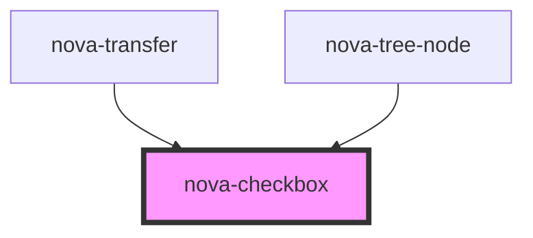

# nova-checkbox

<!-- Auto Generated Below -->

## Properties

| Property      | Attribute  | Description | Type       | Default            |
| ------------- | ---------- | ----------- | ---------- | ------------------ |
| `checked`     | `checked`  |             | `boolean`  | `undefined`        |
| `disabled`    | `disabled` |             | `boolean`  | `undefined`        |
| `handleClick` | --         |             | `Function` | `(_e): void => {}` |
| `styles`      | `styles`   |             | `any`      | `{}`               |

## Events

| Event     | Description | Type               |
| --------- | ----------- | ------------------ |
| `clicked` |             | `CustomEvent<any>` |

## Dependencies

### Used by

 - [nova-transfer](../nova-transfer)
 - [nova-tree-node](../nova-tree-node)

### Graph

----------------------------------------------

*Built with [StencilJS](https://stenciljs.com/)*
