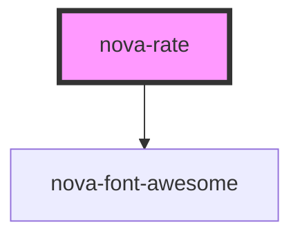

# nova-rate

<!-- Auto Generated Below -->

## Properties

| Property        | Attribute       | Description                                              | Type      | Default     |
| --------------- | --------------- | -------------------------------------------------------- | --------- | ----------- |
| `allowClear`    | `allow-clear`   | Props Allow to clear by setting value to 0               | `boolean` | `true`      |
| `allowHalf`     | `allow-half`    | Allow half values                                        | `boolean` | `false`     |
| `autoFocus`     | `auto-focus`    | Focus the component when mounted                         | `boolean` | `false`     |
| `character`     | `character`     | Replace the icon for a caracter, empty will set the icon | `string`  | `""`        |
| `color`         | `color`         | Sets the color                                           | `string`  | `"#fadb14"` |
| `configuration` | `configuration` | Sets the initial configuration                           | `any`     | `{}`        |
| `count`         | `count`         | Sets the number of stars                                 | `number`  | `5`         |
| `defaultValue`  | `default-value` | Sets the initial value                                   | `number`  | `0`         |
| `disabled`      | `disabled`      | Makes the component "read only"                          | `boolean` | `false`     |
| `icon`          | `icon`          | Sets font awesome icon                                   | `string`  | `"star"`    |
| `size`          | `size`          | Sets the size of the rate component                      | `number`  | `20`        |

## Events

| Event           | Description       | Type               |
| --------------- | ----------------- | ------------------ |
| `onBlur`        | Public API Events | `CustomEvent<any>` |
| `onChange`      |                   | `CustomEvent<any>` |
| `onFocus`       |                   | `CustomEvent<any>` |
| `onHoverChange` |                   | `CustomEvent<any>` |
| `onKeyDown`     |                   | `CustomEvent<any>` |

## Methods

### `blurComponent() => Promise<void>`

Public API Methods

#### Returns

Type: `Promise<void>`

### `focusComponent() => Promise<void>`

#### Returns

Type: `Promise<void>`

## Dependencies

### Depends on

- [nova-font-awesome](../FontAwesome)

### Graph

----------------------------------------------

*Built with [StencilJS](https://stenciljs.com/)*
