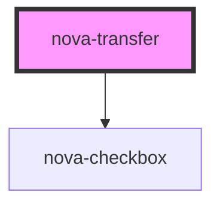

# nova-transfer

<!-- Auto Generated Below -->

## Properties

| Property         | Attribute         | Description | Type       | Default                                                                                                                             |
| ---------------- | ----------------- | ----------- | ---------- | ----------------------------------------------------------------------------------------------------------------------------------- |
| `columnStyle`    | `column-style`    |             | `any`      | `{}`                                                                                                                                |
| `configuration`  | `configuration`   |             | `any`      | `{     labels: {}   }`                                                                                                              |
| `data`           | `data`            |             | `any`      | `{     items: [], // items displayed in columns     targetKeys: [] // keys of the items displayed in the target (right) column   }` |
| `disabled`       | `disabled`        |             | `boolean`  | `undefined`                                                                                                                         |
| `filterOption`   | --                |             | `Function` | `undefined`                                                                                                                         |
| `operationStyle` | `operation-style` |             | `any`      | `{}`                                                                                                                                |
| `renderItem`     | --                |             | `Function` | `undefined`                                                                                                                         |
| `showSearch`     | `show-search`     |             | `boolean`  | `undefined`                                                                                                                         |
| `showSelectAll`  | `show-select-all` |             | `boolean`  | `undefined`                                                                                                                         |
| `styling`        | `styling`         |             | `any`      | `{}`                                                                                                                                |
| `wrapperStyle`   | `wrapper-style`   |             | `any`      | `{}`                                                                                                                                |

## Events

| Event            | Description | Type               |
| ---------------- | ----------- | ------------------ |
| `filter`         |             | `CustomEvent<any>` |
| `scrollColumn`   |             | `CustomEvent<any>` |
| `search`         |             | `CustomEvent<any>` |
| `select`         |             | `CustomEvent<any>` |
| `transferColumn` |             | `CustomEvent<any>` |

## Methods

### `handleSelect(key: string) => Promise<void>`

#### Returns

Type: `Promise<void>`

## Dependencies

### Depends on

- [nova-checkbox](../nova-checkbox)

### Graph

----------------------------------------------

*Built with [StencilJS](https://stenciljs.com/)*
