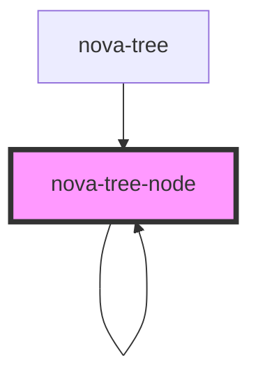

# nova-tree-node

<!-- Auto Generated Below -->

## Properties

| Property            | Attribute            | Description | Type                        | Default                            |
| ------------------- | -------------------- | ----------- | --------------------------- | ---------------------------------- |
| `autoExpandParent`  | `auto-expand-parent` |             | `boolean`                   | `true`                             |
| `blockNode`         | `block-node`         |             | `boolean`                   | `false`                            |
| `checkStrictly`     | `check-strictly`     |             | `boolean`                   | `false`                            |
| `checkable`         | `checkable`          |             | `boolean`                   | `false`                            |
| `checked`           | `checked`            |             | `boolean`                   | `false`                            |
| `defaultExpandAll`  | `default-expand-all` |             | `boolean`                   | `true`                             |
| `disableCheckbox`   | `disable-checkbox`   |             | `boolean`                   | `false`                            |
| `disabled`          | `disabled`           |             | `boolean`                   | `false`                            |
| `expanded`          | `expanded`           |             | `boolean`                   | `false`                            |
| `multiple`          | `multiple`           |             | `boolean`                   | `false`                            |
| `nodeKey`           | `node-key`           |             | `string`                    | `undefined`                        |
| `refToSubnodes`     | --                   |             | `HTMLNovaTreeNodeElement[]` | `[]`                               |
| `selectable`        | `selectable`         |             | `boolean`                   | `DEFAULT_CONFIGURATION.selectable` |
| `selected`          | `selected`           |             | `boolean`                   | `undefined`                        |
| `subnodes`          | --                   |             | `NovaTreeNode[]`            | `[]`                               |
| `text` _(required)_ | `text`               |             | `string`                    | `undefined`                        |

## Events

| Event        | Description | Type               |
| ------------ | ----------- | ------------------ |
| `checkNode`  |             | `CustomEvent<any>` |
| `selectNode` |             | `CustomEvent<any>` |

## Dependencies

### Used by

 - [nova-tree](../nova-tree)
 - [nova-tree-node]()

### Depends on

- [nova-checkbox](../nova-checkbox)
- [nova-tree-node]()

### Graph

----------------------------------------------

*Built with [StencilJS](https://stenciljs.com/)*
