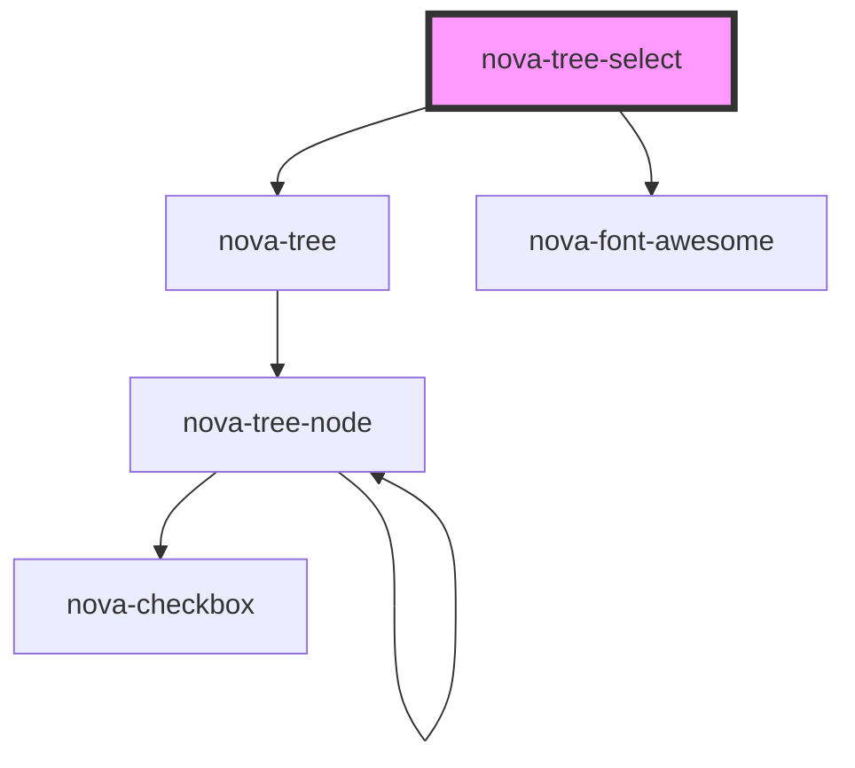

# nova-tree-select

<!-- Auto Generated Below -->

## Properties

| Property        | Attribute        | Description | Type       | Default                 |
| --------------- | ---------------- | ----------- | ---------- | ----------------------- |
| `blockNode`     | `block-node`     |             | `boolean`  | `undefined`             |
| `checkable`     | `checkable`      |             | `boolean`  | `undefined`             |
| `data`          | `data`           |             | `any`      | `{ items: TREE_ITEMS }` |
| `disabled`      | `disabled`       |             | `boolean`  | `false`                 |
| `dropdownStyle` | `dropdown-style` |             | `any`      | `{}`                    |
| `maxTagCount`   | `max-tag-count`  |             | `number`   | `3`                     |
| `multiple`      | `multiple`       |             | `boolean`  | `undefined`             |
| `placeholder`   | `placeholder`    |             | `string`   | `""`                    |
| `selectedKeys`  | --               |             | `string[]` | `undefined`             |
| `styles`        | `styles`         |             | `any`      | `{}`                    |

## Events

| Event      | Description | Type               |
| ---------- | ----------- | ------------------ |
| `onChange` |             | `CustomEvent<any>` |
| `onSelect` |             | `CustomEvent<any>` |

## Dependencies

### Depends on

- [nova-tree](../nova-tree)
- [nova-font-awesome](../FontAwesome)

### Graph

----------------------------------------------

*Built with [StencilJS](https://stenciljs.com/)*
