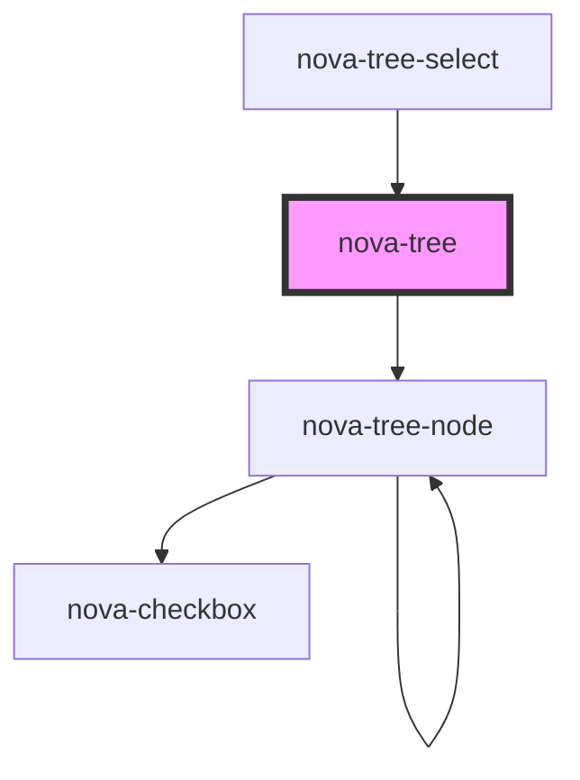

# nova-tree

<!-- Auto Generated Below -->

## Properties

| Property           | Attribute            | Description       | Type                | Default         |
| ------------------ | -------------------- | ----------------- | ------------------- | --------------- |
| `autoExpandParent` | `auto-expand-parent` |                   | `boolean`           | `undefined`     |
| `blockNode`        | `block-node`         |                   | `boolean`           | `undefined`     |
| `checkStrictly`    | `check-strictly`     |                   | `boolean`           | `undefined`     |
| `checkable`        | `checkable`          |                   | `boolean`           | `false`         |
| `configuration`    | --                   | Common attributes | `object`            | `{}`            |
| `data`             | --                   | Common attributes | `{ items: any[]; }` | `{ items: [] }` |
| `defaultExpandAll` | `default-expand-all` |                   | `boolean`           | `undefined`     |
| `disableTree`      | `disable-tree`       |                   | `boolean`           | `undefined`     |
| `disabled`         | `disabled`           |                   | `boolean`           | `undefined`     |
| `multiple`         | `multiple`           |                   | `boolean`           | `undefined`     |
| `nodeKey`          | `node-key`           |                   | `string`            | `undefined`     |
| `selectable`       | `selectable`         |                   | `boolean`           | `false`         |
| `selected`         | `selected`           |                   | `any`               | `undefined`     |
| `selectedKeys`     | --                   |                   | `string[]`          | `[]`            |
| `styles`           | --                   |                   | `object`            | `{}`            |
| `styling`          | --                   | Common attributes | `object`            | `{}`            |

## Events

| Event    | Description | Type               |
| -------- | ----------- | ------------------ |
| `check`  |             | `CustomEvent<any>` |
| `select` |             | `CustomEvent<any>` |

## Methods

### `updateData(data: any) => Promise<void>`

#### Returns

Type: `Promise<void>`

## Dependencies

### Used by

 - [nova-tree-select](../nova-tree-select)

### Depends on

- [nova-tree-node](../nova-tree-node)

### Graph

----------------------------------------------

*Built with [StencilJS](https://stenciljs.com/)*
